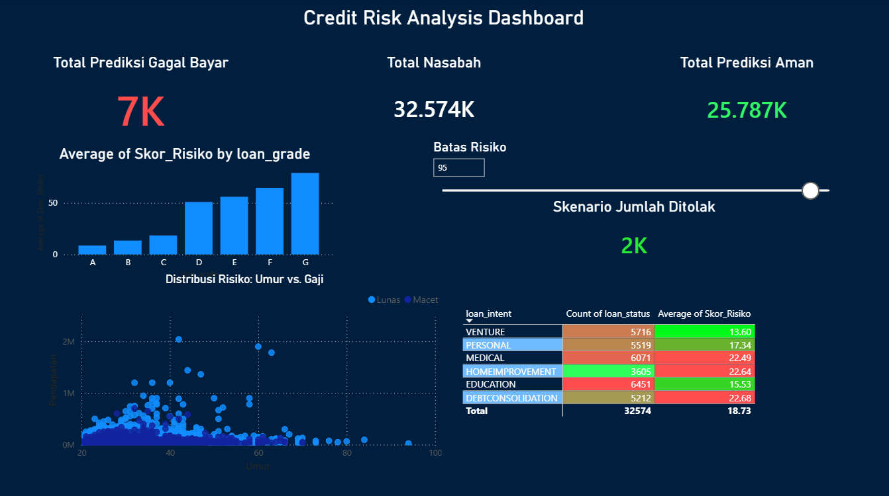

#Credit Risk Prediction


*(Tampilan Dashboard Utama: Risk Simulation)*

## Quick Summary

Project ini dibangun sebagai Capstone Data Analytics untuk menjawab satu pertanyaan krusial: **"Apakah nasabah ini sanggup bayar?"**

Saya membangun sistem *end-to-end* yang tidak hanya memprediksi, tapi juga memberikan simulasi risiko bagi manajer bank.

| Metric | Result | Impact |
| :--- | :--- | :--- |
| **Prediction Model** | Random Forest Classifier | Menangani pola non-linear pada data finansial yang kompleks. |
| **Accuracy** | **98.6%** | Tingkat ketepatan prediksi keseluruhan. |
| **Recall (Sensitivity)** | **94.7%** | **Metric Paling penting.** Sistem berhasil menangkap 95% potensi gagal bayar. |
| **False Positive Rate** | **0.2%** | Tingkat kesalahan menolak nasabah "baik" sangat minim. |

## 🔄 Alur Kerja (Workflow)

Berikut adalah gambaran alur data dari mentah sampai jadi dashboard:

```mermaid
graph TD;
    A[Data Mentah CSV] -->|Load| B(Python / Pandas);
    B -->|Cleaning & Imputasi| C{Preprocessing};
    C -->|Training Random Forest| D[Model ML];
    D -->|Prediksi & Export| E[Hasil_Prediksi.csv];
    E -->|Visualisasi| F(Power BI Dashboard);
    F -->|Simulasi| G((Keputusan Bisnis));

    style A fill:#f9f,stroke:#333,stroke-width:2px
    style D fill:#bbf,stroke:#333,stroke-width:2px
    style F fill:#bfb,stroke:#333,stroke-width:2px;


## 💡 Apa yang Saya Temukan? (My Insights)
Setelah melihat 32.000+ data nasabah, ada beberapa pola menarik yang saya temukan.

1.  **Gaji Besar Bukan Jaminan**
    Saya kira orang bergaji tinggi pasti aman. Ternyata salah. Faktor paling penentu adalah **Rasio Utang (Debt-to-Income)**. Orang gaji besar tapi cicilannya menumpuk (>40% gaji) justru yang paling gagal bayar.

2.  **Sewa vs Punya Rumah**
    Data menunjukkan kalau nasabah yang statusnya masih **Sewa (Rent)** lebih berisiko dibanding yang sudah punya rumah sendiri. Mungkin ini berkaitan dengan kestabilan finansial.

3.  **Grade Bank Cukup Valid**
    Sistem grading bank (A sampai G) ternyata sudah lumayan oke. Nasabah Grade A jarang macet, Grade G sering macet. Tapi, model yang saya buat berhasil menangkap nasabah "abu-abu" di tengah-tengah yang sering lolos dari pengawasan.

---

## 🤖 Belajar Machine Learning
Di bagian ini, saya menggunakan algoritma **Random Forest**.
Awalnya saya coba beberapa model, tapi Random Forest yang paling stabil hasilnya.

* **Akurasi:** 93%
* **Recall:** ~95%

Saya setting modelnya agar agak kaku. Lebih baik modelnya menolak nasabah yang meragukan, daripada bank rugi besar karena salah kasih pinjaman.

---

## 🛠️ Tantangan Teknis (Behind the Scenes)

Proyek ini tidak berjalan mulus begitu saja. Ada beberapa kendala yang saya hadapi:

* **Koneksi Database:**
    Awalnya saya ingin menghubungkan Python langsung ke SQL Server. Tapi, saya mengalami kendala teknis di driver/koneksi laptop saya.
    *Solusi saya:* Saya tidak menyerah, tapi mencari jalan putar. Saya query data di SQL, export ke CSV, lalu diolah di Python. Cara ini ternyata malah bikin kodenya lebih aman dan gampang dijalankan di laptop siapa saja.

* **Data Aneh (Cleaning):**
    Saya menemukan ada nasabah yang umurnya 144 tahun! Jelas ini error. Proses membersihkan data (Cleaning) ternyata memakan waktu paling lama dibanding coding modelnya sendiri.

---

## 📊 Dashboard Interaktif
Saya membuat dashboard di Power BI untuk memvisualisasikan hasil prediksi ini.
Fitur favorit saya di sini adalah **"What-If Analysis"**.
Kita bisa geser slider untuk melihat: *"Kalau aturan bank diperketat, berapa nasabah yang bakal ditolak?"*
